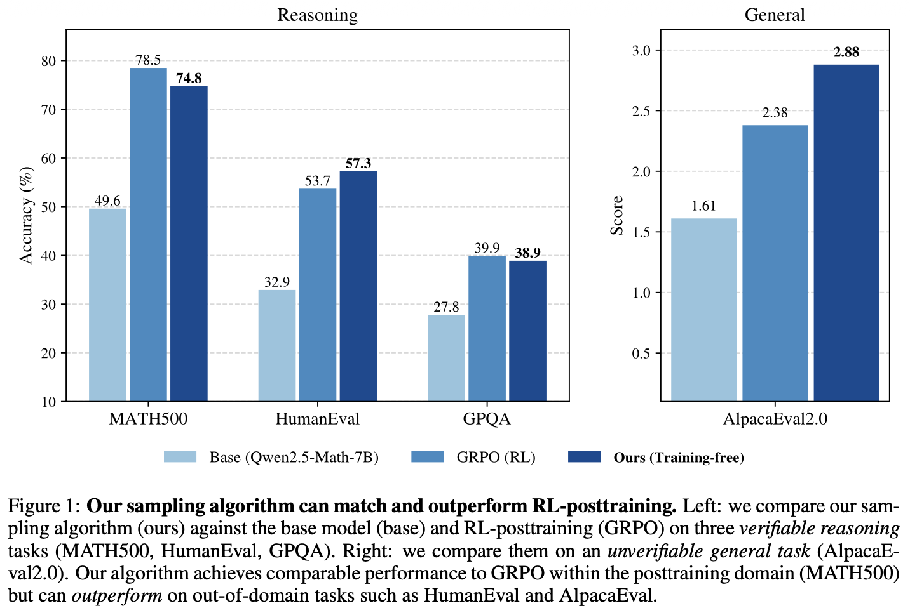

# Large Language Models — Reasoning with Sampling

This repository contains my final project for the course **“Introduction to Generative AI Models”**.  
It focuses on a small-scale, fully reproducible implementation of *test-time sampling-based reasoning* for LLMs, inspired by the research paper below.

The core idea studied here is that a strong base language model can exhibit significantly better reasoning performance **without additional training** by changing *how we sample* at inference time. In particular, the paper proposes **training-free power sampling** (implemented via **blockwise Metropolis–Hastings**, a.k.a. *Power-MH*), which reweights generations toward higher-likelihood reasoning trajectories—often outperforming simple baselines like standard sampling or low-temperature decoding, and approaching/competing with training-based methods in some regimes.

The research paper I studied for my final project assignment is :

**Reasoning with Sampling: Your Base Model is Smarter Than You Think** 
 
Aayush Karan and Yilun Du (arXiv) — training-free *power sampling* (Power-MH) and comparisons to low-temperature sampling / RL baselines.

- Paper: https://arxiv.org/abs/2510.14901  
- Project page: https://aakaran.github.io/reasoning_with_sampling/

---

## Research Paper results

These results and plots below come from the research paper https://arxiv.org/abs/2510.14901, showing comparative accuracies on reasoning benchmarks.  
Source: *Reasoning with Sampling: Your Base Model is Smarter Than You Think* (arXiv:2510.14901).



---


## What this repo implements

A simple experiment pipeline for the **MATH500** benchmark:

1. **Generate** model completions with different inference methods/strategies:
   - `base` (standard sampling)
   - `lowtemp` (temperature τ = 1/α)
   - `power_mh` (training-free Power Sampling via blockwise Metropolis–Hastings)

2. **Merge** per-run CSV files into a single artifact

3. **Evaluate** with **robust math equivalence**

4. **Compute pass@k** curves across multiple seeds

Outputs are stored in `results/math500/...` (raw CSVs, merged CSV, evaluation JSON/plots).

---

## Repository structure

```
scripts/
  generate_math500.py      # generation for base / lowtemp / power_mh
  merge_math500.py         # merge raw CSVs into one CSV
  evaluate_math500.py      # robust evaluation + bar plot
  passk_math500.py         # pass@k curves + plot
  math_equiv.py            # robust answer extraction + equivalence

data/
  math500/                 # auto-downloaded HuggingFaceH4/MATH-500 test split

results/
  math500/
    raw/                   # per-seed CSVs
    merged/                # merged.csv
    eval/                  # scores.json, per_example.jsonl, plots
```

---

## Quickstart (MATH500 benchmark dataset)

### 1) Generate (multi-seed)
Example: 3 seeds, first 100 math problems, 1024 tokens.

```bash
MODEL="Qwen/Qwen2.5-Math-1.5B-Instruct"
SEEDS=(0 1 2)
MAX_EXAMPLES=100

for seed in "${SEEDS[@]}"; do
  python scripts/generate_math500.py --model "$MODEL" --method base     --seed "$seed" --max_examples "$MAX_EXAMPLES" --max_new_tokens 1024 --use_chat_template
  python scripts/generate_math500.py --model "$MODEL" --method lowtemp  --alpha 4 --seed "$seed" --max_examples "$MAX_EXAMPLES" --max_new_tokens 1024 --use_chat_template
  python scripts/generate_math500.py --model "$MODEL" --method power_mh --alpha 4 --B 192 --n_mcmc 3 --seed "$seed" --max_examples "$MAX_EXAMPLES" --max_new_tokens 1024 --use_chat_template
done
```

### 2) Merge
```bash
python scripts/merge_math500.py --run_prefix MATH500 --output_csv results/math500/merged/merged.csv
```

### 3) Evaluate (robust)
```bash
python scripts/evaluate_math500.py --merged_csv results/math500/merged/merged.csv --out_dir results/math500/eval --write_eval_csv
```

### 4) pass@k
```bash
python scripts/passk_math500.py --folder results/math500/raw --run_contains MATH500 --max_k 3 --out_dir results/math500/eval
```

---


## Notes and limitations

- This repo focuses on **MATH500** first. Other tasks from the paper (HumanEval, GPQA, AlpacaEval) will be added later using the same pipeline structure.
- Exact reproducibility of paper numbers requires larger models, longer generation length (e.g., 3072), and more compute (more seeds and more MCMC steps).